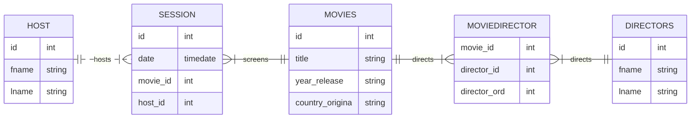

MovieClubSched
==============

A system to manage the movies, sessions and generate the schedule of Movie Club.

# Requirements

The system should:

* Add movies to the database.
* Query if a movie was already shown.
    * When the movie was exbited?
    * What was the attenance?
    * Who was the host?
* Reports:
    * Which movies were exibited last month?
    * Which is the average attendance?

# Entity Relationship

Diagram of the database tables:

# Classes

* Director
* Movie
* Session
* Host

## Class Diretor

* Fields:
    * First and last names.
    * Movies

* Methods:
    * Add (init) director object with name.
    * Add movie.
