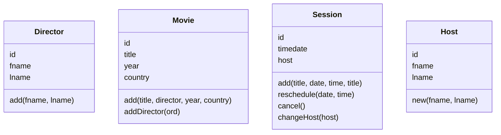

Classes
=======

# Classes

```mermaid
classDiagram
    class Director
    Director: id
    Director: fname
    Director: lname
    Director: add(fname, lname)
    class Movie
    Movie: id
    Movie: title
    Movie: year
    Movie: country
    Movie: add(title, director, year, country)
    Movie: addDirector(ord)
    class Session
    Session: id
    Session: timedate
    Session: host
    Session: add(title, date, time, title)
    Session: reschedule(date, time)
    Session: cancel()
    Session: changeHost(host)
    class Host
    Host: id
    Host: fname
    Host: lname
    Host: new(fname, lname)
```
