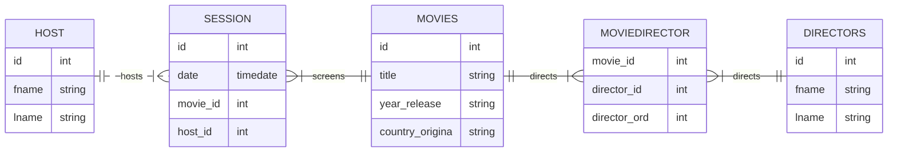

Databases
=========

# Entity Relationship 

The entity relationship diagram

# Entity Relationship

Diagram of the database tables:

```mermaid
erDiagram
    direction LR
    MOVIES ||--|{ MOVIEDIRECTOR  : directs
    MOVIES {
        id int
        title string
        year_release string
        country_origina string
    }
    MOVIEDIRECTOR }|--|| DIRECTORS: directs
    MOVIEDIRECTOR {
        movie_id int
        director_id int
        director_ord int
    }
    DIRECTORS {
        id int
        fname string
        lname string
    }
    SESSION }|--|| MOVIES : screens
    SESSION {
        id int
        date timedate
        movie_id int
        host_id int

    }
    HOST ||..|{ SESSION : hosts
    HOST {
        id int
        fname string
        lname string
    }
```

